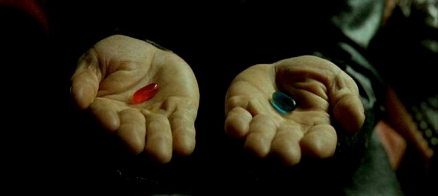

**Ne klişe ama..**

İlk yazıma dünyayı bilmem kaçıncı defa selamlamanın mutluluğuyla yazıyorum! 😅 Umarım sıkılmadan ve sıkmadan öğrendiklerimi, notlarımı sizlerle paylaşabilirim.

Gelecek heyecan verici peki ya şimdi? Çayınızı, kahvenizi eksik etmeyin 🙂 Bilgi okyanusunun içerisine birlikte balıklama dalıyoruz. 3, 2, 1 veee action!

